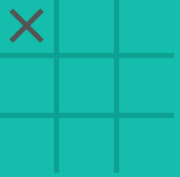
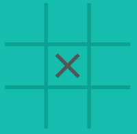
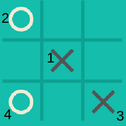

    Tic-Tac-Toe Code Challenge  

    By Qiwei Yang

  

### 1. Preface

Whenever I develop software, the first thing I would do is to define the
scope of the software as clearly as I can, such as functions, data
structures, expandability, etc. However, I skip this essential step this
time because this is a code challenge. I will try my best to demonstrate
my way of thinking, software knowledge, coding skills and software
design capabilities through the implementation of the challenge all by
myself without any guidance.

### 2. Problem Analysis

There are 362,880 (9!) possible different tic-tac-toe games, if the
sequence of steps is considered unique. In theory, a brutal force can be
used to exhaustively search all possible moves for each step to find the
optimal move. However, it is not efficient and takes too much memory.

Fortunately, tic-tac-toe is a well solved game, which means there is an
optimal solution for each step for both players, and if no mistakes are
made, it is guaranteed a draw. In other words, a player can only win
when the opponent makes mistakes. see [reference].

### 2.1 Terminology

Corner: Four Corners of the board. Corners are the most important slots
in this game. If the first move is placed at one of 4 corners, it
generates the highest possibilities to win.

  

Center: the very center slot of 3X3. Intuitively, center looks critical.
However, the possibilities to win if the first move is placed in the
center are less than placing in a corner. 

  

Side: slots are not the corners or the center. Sides are least valuable
slots in the game. 

  

In this game, Player X always moves first, and player O moves following. 

### 2.2 Optimal Strategies

The optimal strategies are essential algorithm to implement an Ai
player. By following the strategies, at least a draw is guaranteed. 

1. If X starts with a corner, O must take the center, otherwise lose.
   Then X's optimal move is take right bottom corner. O must take one of
   sides, otherwise lose. After step 4, its a draw. 

2. If X starts with the center, O must take one of corners, otherwise
   lose. Then X's optimal move is take right bottom corner. O must take
   one of corners remained, otherwise lose. After step 4, its a draw.

   
3. If X begins with a side, X is hardly to win, but O cannot win neither
   if X does not make mistakes. 

### 3. Software Architecture

Two header files are created to store two different classes. One is
named "Board.h", and the other "Agent.h". Basically, Board class
includes all the information about the game, like which slots are taken
by whom, and which slots are free. In addition, it judges if a game has
ended, a win, draw or pending, whenever a player finishes a move. On the
other side, Agent class represents players who can change the
information stored in board class when a move is made. What's more, a
sub-class, called "Ai", is inherited from Agent class, who can play
against with a human using the optimal strategies described above.

#### 3.1 Software environment

This mini software was created in Ubuntu 16.04 with Cmake version 3.13.
This software was tested in Windows 10 to make sure it work as well.

#### 3.2 Board Class

Board class has two important data members, one is vector<vector<int>>,
which is used to represent the game environment; the other one is
symbol, which is used to store "X" or "O". 

Board class mainly has 2 purposes. First, it is the environment where
players play against each other. It constantly tracks each player's
slots and free slots can be taken, and update the environment after a
player has made a valid move. Second, It checks if a game has ended
after a player has made a valid move, either a win, a draw or pending. 

#### 3.3 Agent Class

Agent class represents human players. It is declared as Board class's
friend class, so that it can access and change the value of the board
class's private member.

A check method is implemented in Agent class to make sure it can only
take a free slot. 

#### 3.4 Ai inheritance Class

This class is inherited from Agent class, as they work pretty similarly.
The main difference between Agent and Ai is that Ai is implemented based
on optimal strategies described above. It guarantees a draw. Its
algorithm works in this way:

1. If "X" will win immediately, for example, 2 slots have been in a line by
"X", Ai will take the 3rd slot in that line to prevent losing. 

2. If "X" will not win immediately, it will try to win by taking
   important slots, such as the center or corners. 

In this software, Ai can only play as "O". In the other words, it always
go after the human player. 
#### 3.5 main function

main function primarily works as an interface. It asks the player if
playing with another human player or with an Ai. It keeps tracking the
scores if multiple games are played. 

### 4. Test Case

Due to the symmetry properties of the game, a few test cases have been
created. 

1. Test if the program allows the player to take a slot that has been
   taken.
2. Test if the program can check the errors if the player has wrong
   inputs. 
3. Test if the program can correctly judge a game has ended, and who has
  won.
4. Test if Ai plays as expected. Test if a human player starts with a
  center, a corner, or a side, Ai will respond correctly based on the
  optimal strategies.

### 5. Summary
[reference] (http://www.cs.jhu.edu/~jorgev/cs106/ttt.pdf)
