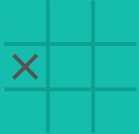

    Tic-Tac-Toe Code Challenge  

    By Qiwei Yang

  

### 1. Preface

Whenever I develop software, the first thing I will do is to define the
scope of the software as clearly as I can, such as functions, data
structures, expandability, etc. However, I skip this essential step this
time because this is a code challenge. I will try my best to demonstrate
my way of thinking, software knowledge, coding skills and software
design capabilities through the implementation of the challenge all by
myself without any guidance.

### 2. Problem Analysis

There are 362,880 (9!) possible different tic-tac-toe games, if the
sequence of steps are considered unique. In theory, a brutal force can
be used to exhaustively search all possible moves for each step to find
the optimal move. However, it is not efficient and takes too much
memory.

Fortunately, tic-tac-toe is a well solved game. That means there is an
optimal solution for each step for both players, and if no mistakes are
made by players, it is guaranteed a draw. In other words, a player can
only win when the opponent makes mistakes. see [reference].

### 2.1 Terminology

Corner: Four Corners of the board. Corners are the most important slots
in this game. If the first move is placed at one of 4 corners, it
generates the highest possibilities to win.

 

Center: the very center slot of 3X3. Intuitively, center looks critical.
However, the possibilities to win if the first move is placed in the
center are less than placing in a corner. 

Side: slots are not the corners or the center. Sides are least valuable
slots in the game. 

In this game, Player X always moves first, and player O moves following. 

### 2.2 Optimal Strategies

1. If X begins with a corner, the only chance that O does not lose is to
   take the center. Then X's best shot is to take the opposite corner of
   its first move. If O does not take a side at the 2nd step, X wins,
   otherwise a draw.

2. If X begins with the center, O must take one of corners, otherwise O
   loses. The only chance that X can possibly win is to take O's
   diagonally-opposite corner. If O then takes one of sides, O loses,
   otherwise a draw.
   
3. If X begins with a side, which is a bad move for X, because its
   possibility to win is greatly reduced. 

### 3. Software Architecture

Two header files are created to store two different classes. One is
named "Board.h", and the other "Agent.h". Basically, Board class
includes all the information about the game, like which slots are taken
by whom, and which slots are empty. In addition, it judges if a game has
ended whenever a player finishes a move. On the other side, Agent class
represents players who can change the board class when a move is made.
What's more, a sub-class, called "Ai", is inherited from Agent class,
who can play against with a human using the optimal strategies described
above.

#### 3.1 Board Class

#### 3.2 Agent Class

#### 3.3 AI inheritance Class

#### 3.4 main function

### 4. Summary
[reference] (http://www.cs.jhu.edu/~jorgev/cs106/ttt.pdf)
